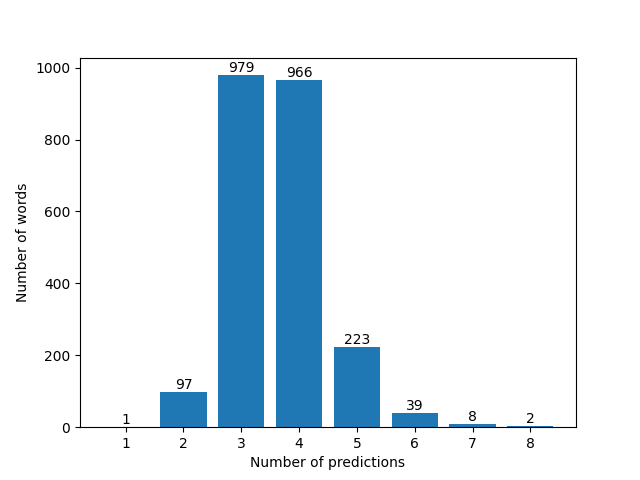

## Wordle Solver
> [Wordle](https://www.nytimes.com/games/wordle/index.html) is a web-based word game developed by Welsh-born software engineer Josh Wardle, formerly an employee of Reddit. Players attempt to guess a five-letter word in six attempts; feedback, in the form of colored tiles, is given for each guess, informing players which letters are in the correct position and which are in other positions of the answer word. ([source](https://en.wikipedia.org/wiki/Wordle))

I created a solver from scratch that uses a simple algorithm built upon the basic rules of the game and a couple of predetermined useful predictions to solve Wordle. There are no search/decision trees, learning models or intelligent agents; just plain old DSA. The algo has still managed to reach avg. levels of predictions that are less than 0.21 away from the [best known automated solver (avg. 3.42)](https://jonathanolson.net/wordle-solver/).

## Statistics
* Total words: 2315
* Average number of predictions per word: 3.6358
* Number of words failed (i.e took more than 6 guesses): 10
* Accuracy: **99.56%**

## Usage
1. Run wordle_solver.py: `python wordle_solver.py`.
2. Use the prediction provided by the algorithm.
3. Enter the feedback in the form of "GYBBY", where
  * B stands for black/grey.
  * Y stands for yellow.
  * G stands for green.
Repeat until you win.
